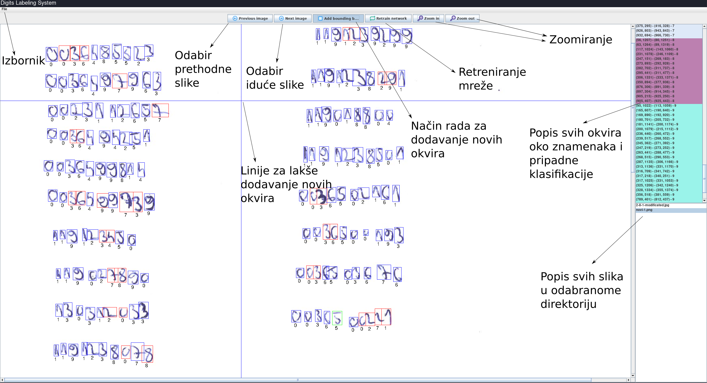
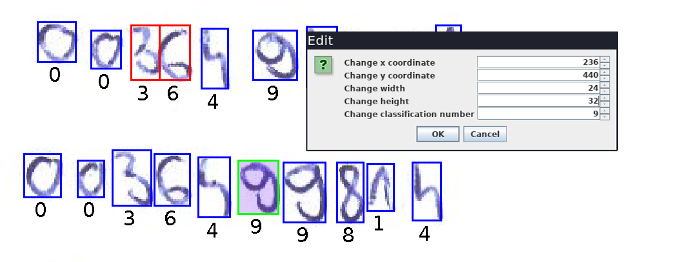

# Deep Models Based Recognition of Student Identifiers
Classification and localization of student identifiers based on the convolutional neural network. 

This paper describes a system that apart from recognition, also performs localization, or performs detection of handwritten digits. The system at the entrance receives an image of handwritten identifiers that is transformed into binary and contours of the identifiers are bolted. Based on the height, width and relationship between the boundary boxes, merging and filtering of the found boxes are performed. In the postprocessing phase based on the width of the box, classifier’s confidence and perplexity (entropy), problematic boundary boxes are found and the sliding window method is applied to resolve these boxes. The analysis is done using the dynamic size of the sliding window and based on the perplexity of the model the division of the boundary box is performed. The system is wrapped in an application with a simple and intuitive graphical user interface. The problematic bounding boxes are visually highlighted so that the user can easily detect and resolve possible system errors. Through the graphical interface, it is possible to edit the found boundaries and the corresponding classifications. The system thus enables the generation of an even larger learning dataset and retraining the network on a newly built dataset of handwritten identifiers that make the classifier even more robust.

